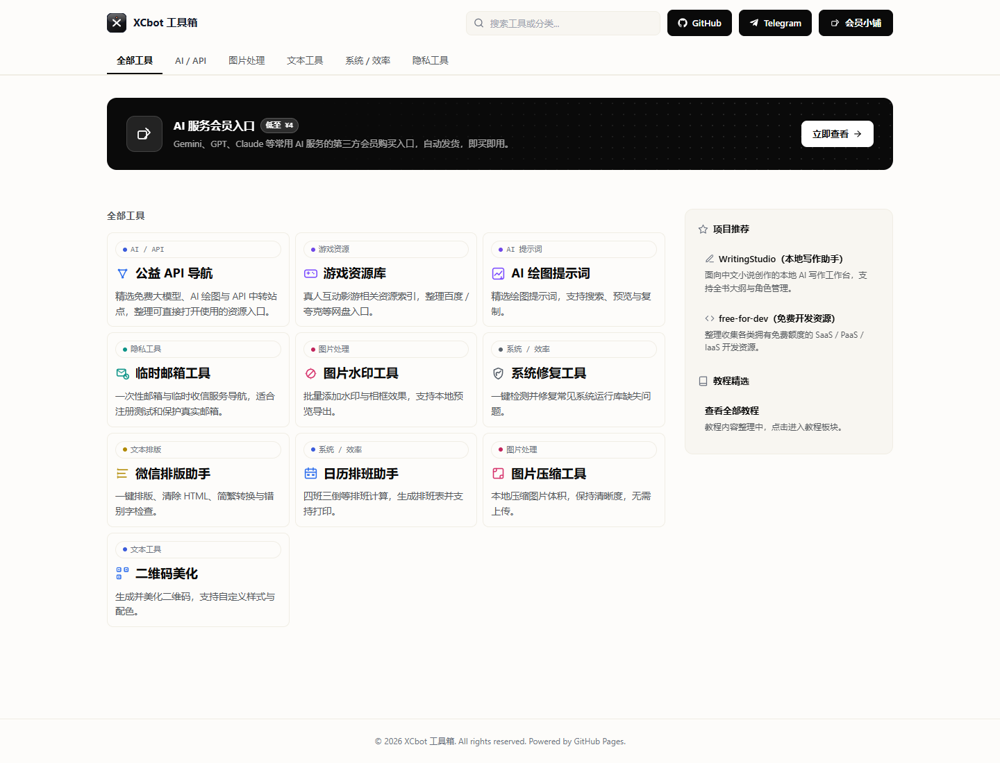
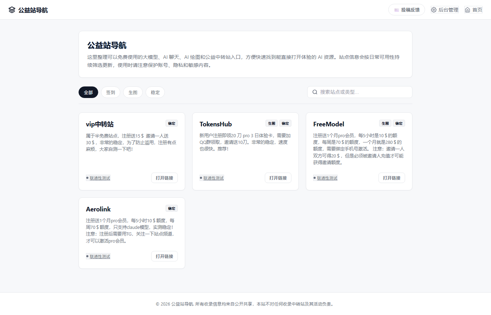
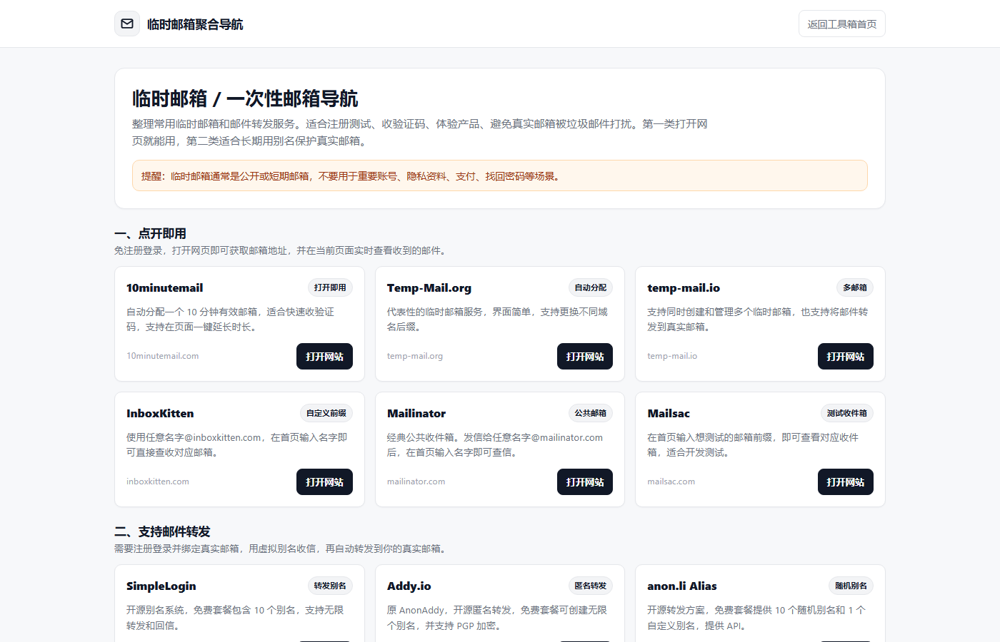
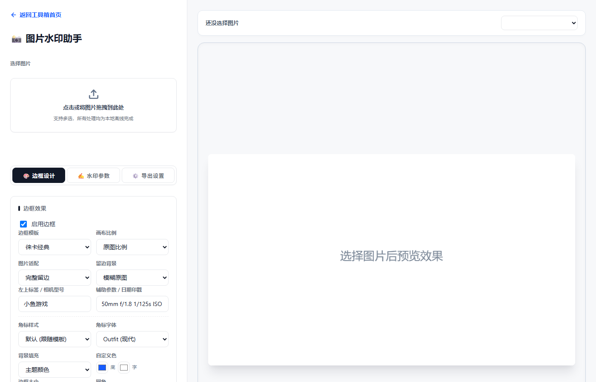
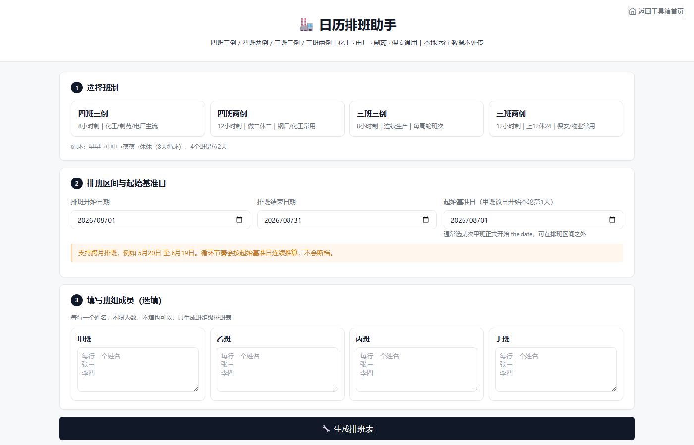

# XCbot 工具箱 (xcbot.cyou)

一个以静态页面为主的在线工具聚合站。站点以本地浏览器工具为主，同时收录 AI、临时邮箱、资源索引等实用导航入口；图片处理等文件类工具在浏览器内完成，数据不上传服务器。基于 GitHub Pages 部署，导航类动态数据通过 Cloudflare Worker + KV 管理。

🌐 **在线访问**：<https://xcbot.cyou>



## ✨ 特点

- **前端轻量**：原生 HTML / CSS / JavaScript，无构建步骤，静态页面可直接发布
- **本地优先**：图片处理、二维码、排版等文件/文本类工具优先在浏览器内完成，减少数据上传
- **导航聚合**：统一整理 AI 服务、临时邮箱、资源索引等第三方入口，方便快速访问
- **轻量部署**：push 到 main 分支，GitHub Actions 自动发布到 GitHub Pages（约 35-45 秒生效）
- **GitHub 风格 UI**：白底深色 header、横排卡片、分类 tag，简洁清爽

## 🧰 收录工具

| 工具 | 说明 | 链接 |
| --- | --- | --- |
| 🖼️ 图片水印助手 | 批量添加水印与胶片/徕卡风格边框，支持本地预览与导出 | [/watermark/](https://xcbot.cyou/watermark/) |
| 🔧 运行库修复 | 一键检测并修复常见系统运行库缺失问题 | [/system-repair/](https://xcbot.cyou/system-repair/) |
| 📝 文本排版助手 | 一键排版、清除 HTML、简繁转换、错别字检查 | [/typesetter/](https://xcbot.cyou/typesetter/) |
| 📅 日历排班助手 | 四班三倒等排班计算，生成排班表并支持打印导出 | [/shift-helper/](https://xcbot.cyou/shift-helper/) |
| 🗜️ 图片智能压缩 | 本地压缩图片体积，保持清晰度的同时减小文件大小 | [/compressor/](https://xcbot.cyou/compressor/) |
| 🔳 二维码美化助手 | 生成并美化二维码，支持自定义样式与配色 | [/qrcode/](https://xcbot.cyou/qrcode/) |
| 🧭 公益 API 导航 | 免费大模型、AI 绘图、API 中转站等资源入口整理 | [/api-nav/](https://xcbot.cyou/api-nav/) |
| 🌐 常用网站导航 | 接码、机场、梯子、工具站等常用网站入口整理 | [/common-nav/](https://xcbot.cyou/common-nav/) |
| 🎮 游戏资源库 | 真人互动影游相关资源索引，整理百度 / 夸克等网盘入口 | [/games/](https://xcbot.cyou/games/) |
| 🎨 AI 绘图提示词库 | 精选绘图提示词，支持搜索、预览与复制 | [/prompts/](https://xcbot.cyou/prompts/) |
| 📮 临时邮箱导航 | 一次性邮箱、临时收信和邮件转发服务导航，适合注册测试和保护真实邮箱 | [/temp-mail/](https://xcbot.cyou/temp-mail/) |

## 📸 截图预览

### 首页


### 公益站导航


### 临时邮箱聚合导航


### 图片水印助手


### 日历排班助手


## 🏗️ 目录结构

```
.
├── index.html              # 首页（工具聚合入口）
├── watermark/              # 图片水印助手
├── system-repair/          # 运行库修复
├── typesetter/             # 文本排版助手
├── shift-helper/           # 日历排班助手
├── compressor/             # 图片智能压缩
├── qrcode/                 # 二维码美化助手
├── api-nav/                # 公益 API 导航（含后台管理 admin.html + sites.json CMS）
├── common-nav/             # 常用网站导航（独立后台 + 自定义分类）
├── games/                  # 游戏资源库
├── prompts/                # AI 绘图提示词库
├── temp-mail/              # 临时邮箱聚合导航
├── tutorials/              # 教程内容入口
├── docs/
│   └── screenshots/        # README 截图
└── .github/workflows/
    └── deploy.yml          # GitHub Pages 自动部署
```

## 🛠️ 技术栈

- **前端**：原生 HTML / CSS / JavaScript（无框架、无构建工具）
- **部署**：GitHub Pages + GitHub Actions
- **CMS**：导航类后台通过 Cloudflare Worker 写入 KV

## 🚀 部署方式

1. Fork 或克隆本仓库
2. 在仓库 Settings → Pages 中选择 "GitHub Actions" 作为构建来源
3. push 到 `main` 分支，`.github/workflows/deploy.yml` 会自动编译并发布
4. 约 35-45 秒后即可通过 `https://<用户名>.github.io/<仓库名>/` 访问

如需自定义域名，在仓库根目录添加 `CNAME` 文件并配置 DNS 即可。

## 🧭 导航后台

`api-nav/admin.html` 和 `common-nav/admin.html` 提供了无服务器后台管理面板：

- 通过 Cloudflare Worker 管理密钥写入 KV，保存后前台实时读取
- 公益 API 导航数据存放在 KV 的 `sites` key
- 常用网站导航数据只存放在 KV 的 `commonSites` key，并支持自定义分类
- 管理密钥仅保存在浏览器 LocalStorage，不上传至任何第三方
- 前台只读取去除跳转地址后的公开数据，真实跳转地址只在 Worker 后台读取并通过 `/common-sites/open?id=...` 跳转

## 📄 License

本项目仅作工具聚合与个人使用，所有子工具的版权归各自所有。

---

&copy; 2026 XCbot 工具箱 · Powered by GitHub Pages
